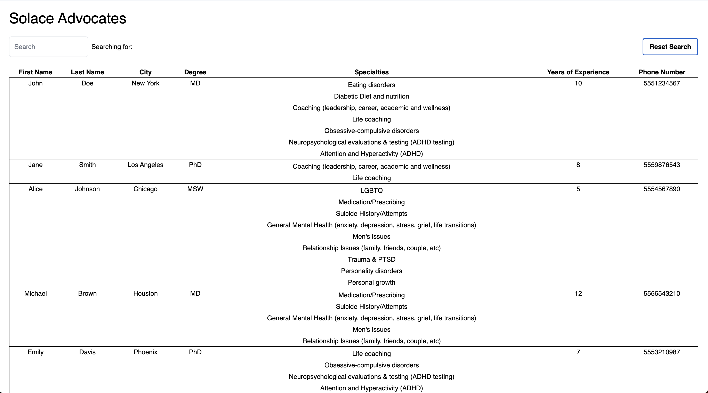

### Pull Request Breakdown

| PR                                               | Title                                                                         | Description                                                                                                                                                                                                        | Tags                                |
| ------------------------------------------------ | ----------------------------------------------------------------------------- | ------------------------------------------------------------------------------------------------------------------------------------------------------------------------------------------------------------------ | ----------------------------------- |
| [#1](https://github.com/pporche87/solace/pull/1) | `chore: initial project setup and light cleanup`                              | Bootstrapped the project. Connected to database, removed inline styles, cleaned up early errors, extracted constants, and added Tailwind-based styling.                                                            | `chore`, `fullstack`, `infra`       |
| [#2](https://github.com/pporche87/solace/pull/2) | `feat(api): server-side pagination and filtering for advocates endpoint`      | Implemented `limit` / `offset` pagination and dynamic filtering logic on the API. Prepared the backend for large datasets and integrated query param parsing.                                                      | `api`, `enhancement`, `performance` |
| [#3](https://github.com/pporche87/solace/pull/3) | `refactor(client): UI reorg, font fix, and reusable API utils`                | Introduced `query-string`, debounced search, reusable fetch helpers, moved font to CSS, extracted `AdvocatesTable`, and added a server-aware `HomeClient`. Extended the `Advocate` type for backend compatibility. | `chore`, `client`, `performance`    |
| [#4](https://github.com/pporche87/solace/pull/4) | `feat(client/ui): improve table UX, refactor rendering logic, responsiveness` | Added `react-super-responsive-table`, created `TableHeader`/`TableRow` components, introduced constants for rendering logic, added `previousSearchTerm` for reset behavior, and improved layout structure.         | `client`, `enhancement`             |
| [#5](https://github.com/pporche87/solace/pull/5) | `feat(client): implement infinite scroll with React Query`                    | Integrated `@tanstack/react-query`, created `useAdvocatesQuery` and `useInfiniteScroll`, added `IntersectionObserver` component, cleaned up SSR logic, and introduced a `Providers` wrapper for client state.      | `client`, `enhancement`             |

### Time-Sensitive Deferrals

To stay within the suggested time window, I focused on core functionality and deferred some enhancements. Below are features I would implement next and why.

#### API

1. Infrastructure & Performance

- Add `in-memory cache` (e.g., LRU or TTL-based)
- Add `distributed cache` (e.g., Redis)
- Distributed logging
- Expose a `cache invalidation endpoint` for admin/internal use
- Replace `ILIKE` queries
  - `PostgreSQL` full-text search or
  - A `vector search index`` for semantic/AI-enchanced matching
- Testing
  - Add `fetch-mock` tests for API layer (pagination, filtering)
- Feature Expansion
  - Add authentication
    - Firebase, Okta, or homegrown
  - Add `POST /advocates`
    - Allow providers to sign up directly
  - Add admin dashboard
    - Build with Retool, Next.js, or node-based internal UI

#### Client

1. List Virtualization
2. Testing

- Add `jest` for utilities and rendering logic
- Add `e2e` tests using `Cypress` or `Playwrite` (basic smoke tests)
- Integrate tests in `CI/CD` (e.g. Github Actions)
- QA Enablement: Add m`manual test cases` alongside automated tests (`Qase` or simple markdown)
  - Examples
    - Search for advocate by different values returns expected results
    - Filtering works in combination with pagination
    - Reset button returns unfiltered results
      - Goal: reduce cognitive load of testing and encourage collaborative QA before production deployments

3. Responsive & UX Enhancements

- Implement smart text truncation on table cells for smaller screens
- Improve mobile layout (currently untested)
- Remove "Searching for..." label - search input alone may be sufficient
- Add `SSR` for initial advocate fetch (did in branch `patrick/004`)
  - Would re-integrate using `useQuery` + server prefetch

4. Tooling & Dev Experience

- Add `Storybook` for components
- Collaborate with design to build shared `Design System`
- Further modularize typography and layout components for reuse

5. Deployment

- Deploy to `Vercel` with env vars + preview URLs

6. Analytics & Insights

- Integrate `analytics` to monitor user behavior and engagement
  - Tools: `Vercel Analytics`, `Amplitude`, or another service
- Track key events
  - Advocate search and selection
  - Pagination behavior and query load
  - Scroll depth or engagement patters

7. Loading & Empty States

- Add simple loading state
- If no results, display fallback

8. Error Handling

- Introduce robust error boundaries and API error messages
- Toast notifications or banners

9. Accessibility (a11y)

- Invest in semantic HTML and screen reader support

10. CI Setup

- Wire CI to run tests, type-checks, and linting automatically
  - `Github Actions`, `Prepush` hook

11. Performance Optimization & Lighthouse Auditing

- If given more time, I would run a `lighthouse report` against both mobile and desktop views
  - `Largest Contentful Paint (LCP)`
    - Defer or lazy-load non-essential content
    - Inline critical CSS and preconnect fonts
  - `Style and layout shifts (CLS)`
    - Prevent layout shift of font load and table rehydration
    - Ensure spacing/padding is consistent across breakpoints

### Demo Context

